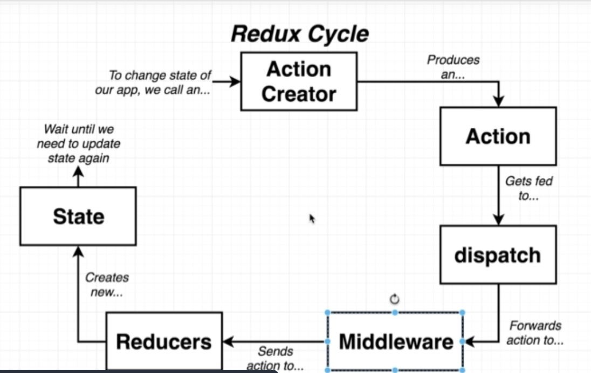

# Modern React with Redux Tutorial: Blog App (covering Redux and Redux Thunk)
- [Udemy Course](https://www.udemy.com/course/react-redux/)
- Course Section: 18

## Getting Started with Create React App
This project was bootstrapped with [Create React App](https://github.com/facebook/create-react-app).

## Local Development
* To start the app, run `npm start`

## Topics
* Redux
  * actions
    * synchronous action creators
    * asynchronous action creators
      * middleware (using React Thunk)
  * reducers
  * connect function

